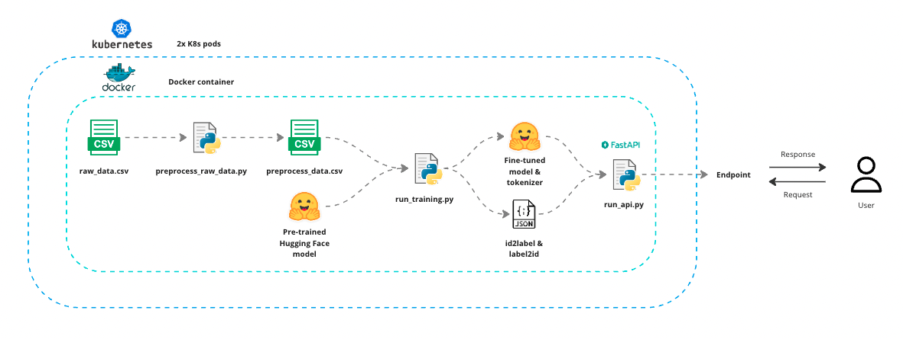

# Train & Deploy Named Entity Recognition Model

<p align="center">
  
</p>


## What is this repo about?
This repository contains code to train and deploy a Named Entity Recognition (NER) model. 


NER is a process in natural language processing that involves identifying and categorising key information (entities) in text into predefined categories, such as names of people, organisations, locations, dates, and other specific data. It enables the extraction of structured information from unstructured text, facilitating data analysis and machine understanding of documents.

<p align="center">
  
</p>


## What is in this repo?

This repo contains:

- Scripts to fine tune a DistilBERT model for Named Entity Recognition with the traditional approach (train weights of the model head) or LoRA.
- The option of using accelerate for distributed training
- Model inference scripts
- FastAPI script to create model endpoint
- Build and deploy docker container
- Deploy docker image with Kubernetes
- GitHub actions CI/CD pipeline to deploy Docker image to my Docker Hub 


## How do you run the code?

1. To set up the local environment

```
cd ner-model
make init-local-env
```

2. To create model training data

```
make preprocess-data
```

3. To run training script locally
- Note, to improve speed the default set-up only trains with a sample of the data. Change the `df_sample_size` parameter in `ner-model/src/static.yaml` if you wish to train with more data.
```
make run-training-locally
```

4. To run inference locally
```
make run-inference-locally
```

5. To run the API locally
```
make run-api-locally
# open new terminal
make api-test
make api-predict
```

6. To deploy the dockerfile

```
make deploy-dockerfile
# open new terminal
make api-test
make api-predict
```

7. To deploy the dockerfile via docker compose
```
make deploy-docker-compose
# open new terminal
make api-test
make api-predict
```

8. To deploy on K8s locally, note you have to build the docker image first.

Open Docker Desktop -> Settings -> Kuberenes -> Tick Enable Kubernetes -> Apply and restart
```
make deploy-k8s
```

To check the k8s service is created run

```
kubectl get services
```

9. To delete the local poetry environment
```
make delete-local-env
```

10. To stop k8s cluster and delete and remove all docker containers and images
Open Docker Desktop -> Settings -> Kuberenes -> Untick Enable Kubernetes -> Apply and restart
```
docker system prune -y # be careful with running this command as it will remove all docker containers and images on your system
```

10. To use the CI/CD pipeline to add the image to your own Docker Hub

- Add secrets for your `DOCKERHUB_TOKEN` and `DOCKERHUB_USERNAME` 
To do this: repository settings > Secrets and variables > Actions > Repository secrets > New repository secret. 

Note, these commands default to using the traditional approach for fine-tuning (training the model head). To use LoRA change the filepaths specified in the `Makefile` and `Dockerfile`.

Currently, this doesn't work as I'm using mac on my local system and linux (ubuntu-latest) for github actions. This causes an incompatibility issue with pytorch where it downloads the GPU version on my local, but cannot on the linux machine. ubuntu-latest has docker preinstalled. Macos does not, and throws errors when trying to install. Can resolve this issue by not running training pipeline in docker image.

## Future ideas
- Only create docker image for API and model artifacts, training could be separate pipeline. Could create two poetry environments.
- CI/CD for automated retraining
- Accelerate config file to set parameters
- Persistent storage (local or S3) for the trained model. To achieve with docker mount the folder path to the container folder path e.g. for local use `docker run -p 8000:8000 -v /Users/path_to_folder:/app/data my_ner_app:latest-inference` and remove the Dockerfile lines which copy the model artifacts to the image in the inference build stage. To extend to k8s, update the deployment file to use:

```
spec:
      containers:
      - name: my-api-container
        image: my_ner_app:latest-inference
        ports:
        - containerPort: 8000
        volumeMounts:
        - name: my-local-volume
          mountPath: /path/inside/container
      volumes:
      - name: my-local-volume
        hostPath:
          path: /path/on/local/machine
          type: Directory
```


## Troubleshooting
- torch must be `2.0.*` due to segmentation fault error on M1 Macs [see here](https://stackoverflow.com/questions/77290003/segmentation-fault-when-using-sentencetransformer-inside-docker-container)
- CI/CD pipeline is broken since I change pytorch version to 2.0.1. Code runs on my local M1 mac. However, runner in github actions is linux (ubuntu-latest). I chose this as it pre-installs docker. I have tried using a macos runner, but it breaks when trying to install docker. The linux machine is CPU enabled but my code tries to install the CUDA GPU compatible version of pytorch. 
  - Keep trying to get macos runner to work?
  - Different pytorch version?